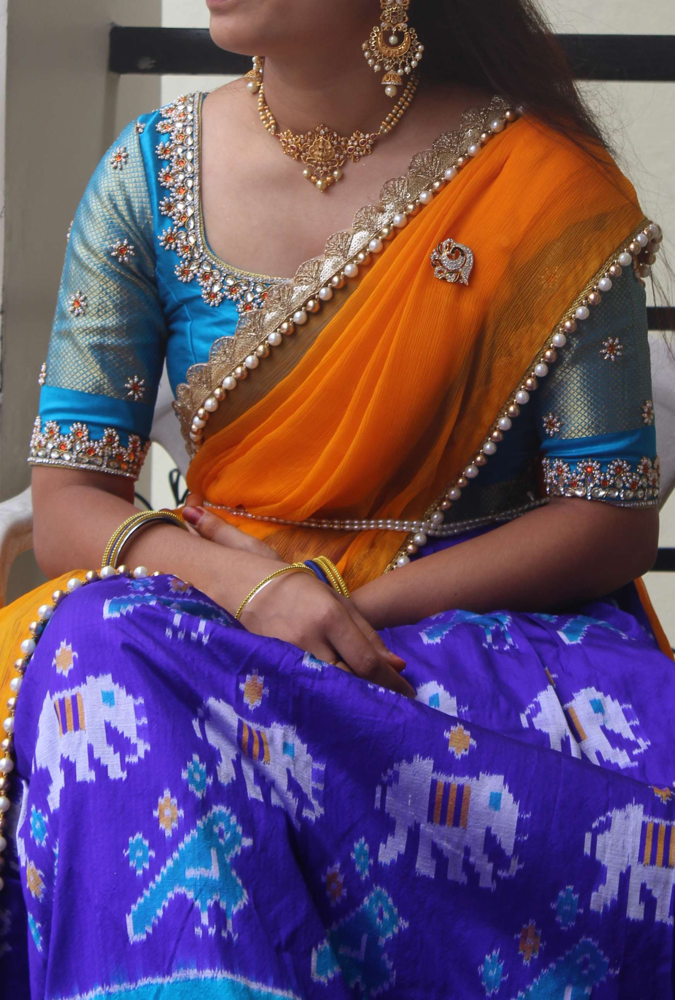
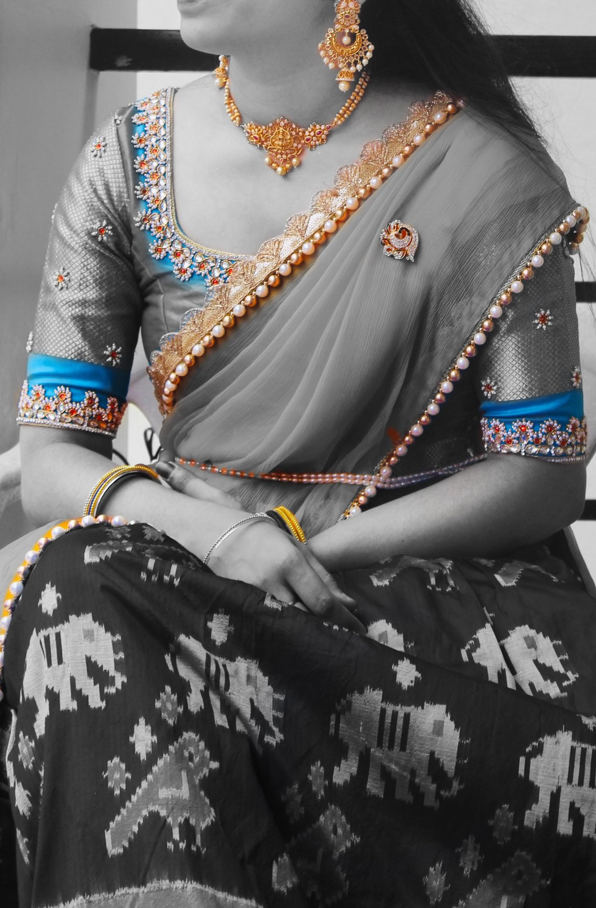

# Snapseed - The best app which can make you Smarter and Stylish

## About:
- Snapseed is a photo-editing application produced by Nik Software, owned by Google, available for both iOS and Android, which enables users to enhance photos and apply "Digital and High-Dimensional" filters.

- **Snapseed** users can edit pictures using swiping gestures to select different effects and enhancements. Alternatively, users can opt for an "automatic" adjustment of color and contrast. Snapseed can save users editing history and redirect to any of the actions before. 

Download it [here](https://apps.apple.com/us/app/snapseed/id439438619) for iOS and [here](https://play.google.com/store/apps/details?id=com.niksoftware.snapseed&hl=en_US) for Android 

## Logo:

## How to use:
1. Tap the **+** icon and import the picture you want to edit from your device/gallery
2. You can see the following three tabs
    1. **LOOKS**
    2. **TOOLS**
    3. **EXPORT**
3. **Undo** and settings option at right top corner.
4. Apply the required edits using the above options, click **Export** and save the new Stylish picture to your device.
  
## Vital Features in TOOLS:
Snapseed supports many options in tools. Some of the important tools, which will help you more:
- **Selective**: Option used to increase/decrease Brightness, Contrast, Saturation and Structure by selecting the area you want to make changes. This is also used to remove dark circles, which is crucial for girls...Just kidding...:-)
- **Healing**: Option used to remove dark spots and pimples etc...
- **Portrait**: Option used to whiten and smoothen your face, which will be automatically detected by Snapseed. You can change the amount of whitening inside the portrait option.
- **Lens Blur**: Option used to blur some part of your picture and adjust the amount of blurness, based on your requirement.

## Other Basic tools:
Few basic features you can find in any editing app like Crop, Rotate, Straighten, Tilt and so many. Snapseed filters are really stunning which you can't find in any other app.

**Note**: One special and important feature in Snapseed is "Picture's resolution will not be reduced, even after editing the picture. Pixels will not be reduced/merged unless until you apply so many filters.
***

  > You can see my sample Snapseed edit as follows

**Before editing**: 

**After editing**: 

***

# Challenge for you:
Here is a big challenge for you. Use snapseed for editing your favorite picture and show your editing skills. You can project the output at my [instagram](https://www.instagram.com/cherry_prasanna/)

**Come on girls...Hurry up!!!**

**References**:
- [Markdownguide](https://www.markdownguide.org)
- [Snapseed Logo](https://tr2.cbsistatic.com/hub/i/r/2017/06/27/a8c9dffc-6902-4f5b-99bc-83c0f12007ab/resize/1200x/33ae27ebbc178931bb1a341c38c74011/snapseedhero.jpg)
- [Wikipedia](https://www.wikipedia.org/)

